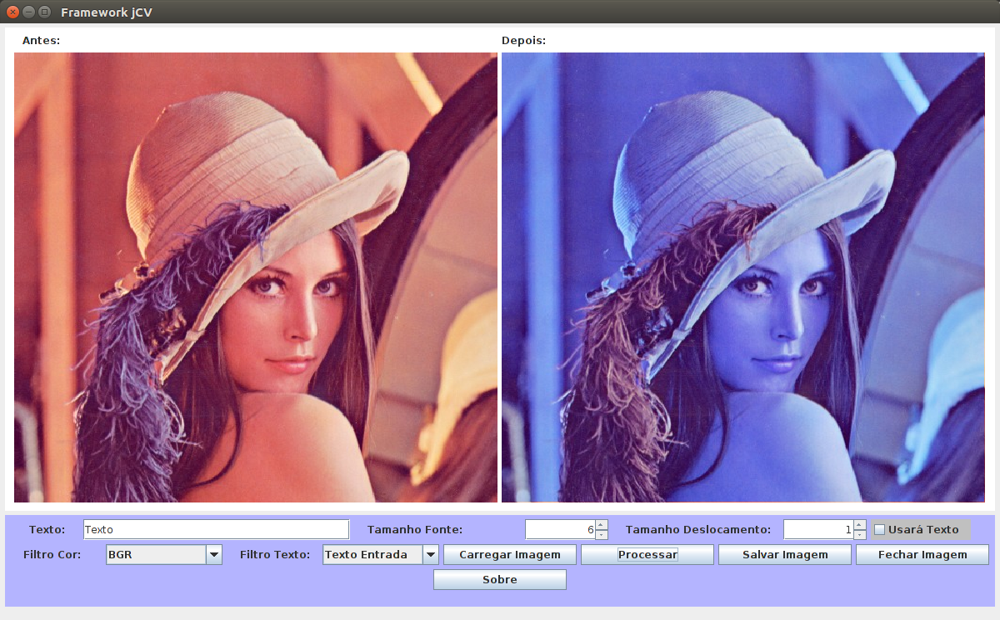

# Framework-jCV

Framework para processamento de imagens e visão computacional.

## Transformações possíveis:

* Converter RGB para Preto e Branco utilizando média aritmética
* Converter RGB para Escala de Cinzas utilizando média aritmética
* Converter RGB para RBG 
* Converter RGB para GBR
* Converter RGB para GRB
* Converter RGB para BGR
* Converter RGB para BRG
* Converter RGB para CYM
* Converter RGB para CMY
* Converter RGB para YCM
* Converter RGB para YMC
* Converter RGB para MYC
* Converter RGB para MCY
* Converter RGB para Preto e Branco utilizando média geométrica
* Converter RGB para Escala de Cinza utilizando média geométrica

OBS: As transformações RBG, GBR, GRB, BGR, BRG apenas inverte as coordenadas das cores.

OBS: As transformações CYM, CMY, YCM, YMC, MYC, MCY pega 255 menos as cores relativas.
